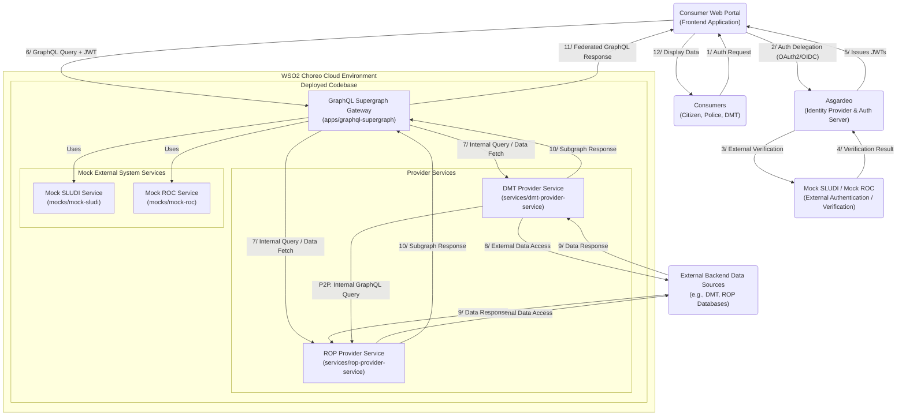

# System Architecture: Open Data Exchange Sandbox

## 1\. Introduction

This document provides a high-level overview of the architecture for the Open Data Exchange Sandbox. The platform aims to facilitate secure and governed data exchange between various government entities, businesses, and citizens, acting as both data consumers and providers. The architecture leverages WSO2 Choreo for platform capabilities, Ballerina for microservices development, and GraphQL for flexible data access.

## 2\. Goals and Principles

  * **Security & Trust:** Ensure secure authentication, authorization, and data transfer.
  * **Scalability & Performance:** Handle growing data volumes and user traffic efficiently.
  * **Modularity & Maintainability:** Use microservices for independent development and deployment.
  * **Interoperability:** Facilitate seamless data exchange between diverse systems.
  * **Observability:** Provide insights into system health and performance.
  * **Governance:** Implement policies for data access, usage, and auditing.

## 3\. High-Level Architecture Diagram

## 4\. Core Components & Their Roles

### 4.1. Actors & External Systems

  * **Consumer Web Portal (`apps/portal/`):** A unified frontend application (e.g., React, Next.js) serving all consumer types (Citizen, Police, DMT). It initiates authentication flows and interacts with the `GraphQL_Supergraph` for all data retrieval and mutation.
  * **Consumers (Citizen, Police, DMT):** The end-users interacting with the system through the Web Portal. DMT acts as both a consumer (of ROP data) and a provider.
  * **Asgardeo:** The central Identity Provider and Authorization Server. It manages user identities, handles authentication protocols (OAuth 2.0 / OpenID Connect), and issues JWTs (ID Token, Access Token) upon successful authentication.
  * **Mock SLUDI / Mock ROC (External Authentication / Verification):** Represent simulated external systems that Asgardeo delegates to for specific identity verification steps (e.g., citizen authentication via SLUDI, business registration verification via ROC).
  * **External Backend Data Sources (e.g., DMT, ROP Databases):** The actual, external data sources that the provider services (`DMT_Provider`, `ROP_Provider`) interact with to fetch or update real data. In a sandbox, these might also be mocked or simplified databases.

##### 4.2. WSO2 Choreo Cloud Environment (Platform Features)

The entire "The Deployed Codebase" resides within the WSO2 Choreo Cloud Environment. Choreo implicitly provides crucial platform services:

  * **API Gateway:** Choreo automatically provides an API Gateway layer for externally exposed components (like `GraphQL_Supergraph`), handling traffic management, rate limiting, and foundational security (e.g., applying WAF rules, validating initial API keys/tokens if configured at this layer).
  * **Service Discovery:** Choreo's underlying Kubernetes-based infrastructure provides automatic service discovery. Components deployed within Choreo can discover and communicate with each other using internal DNS names (e.g., `http://dmt-provider-service`).
  * **Policy Enforcement:** Choreo allows for platform-level policies (e.g., global throttling, network policies, security configurations) to be configured via its console.
  * **Observability:** Choreo provides built-in logging, monitoring, and tracing capabilities for all deployed components.

##### 4.3. The Deployed Codebase (GitHub Structure Mapping)

This section maps directly to the `gov-dx-sandbox` GitHub repository:

  * **GraphQL Supergraph Gateway (`apps/graphql-supergraph/`):**

      * **Role:** The primary entry point for all GraphQL queries from the `Portal`. It acts as the central orchestrator and API gateway for The GraphQL layer.
      * **Functionality:**
          * Receives GraphQL queries with JWTs from the `Portal`.
          * Performs JWT validation (signature, expiry, issuer, audience) and extracts claims (user ID, roles, scopes).
          * Enforces centralized authorization policies based on these claims.
          * Uses GraphQL Federation to compose the schemas of various `Provider Services` (subgraphs).
          * Routes incoming queries to the appropriate `Provider Services` (subgraphs) using Choreo's internal service discovery.
          * Aggregates responses from subgraphs and returns a unified GraphQL response to the `Portal`.
          * Interacts with `Mock_SLUDI_Service` and `Mock_ROC_Service` for specific mock data needs during authentication flows (as orchestrated by Asgardeo).
      * **Technology:** Implemented using Ballerina.

  * **Provider Services (`services/`):**

      * Independent microservices, each representing a distinct domain (e.g., Department of Motor Transport, Registry of Persons).
      * Each service exposes a GraphQL endpoint as a **subgraph**, contributing a specific part of the overall federated GraphQL schema.
      * They are responsible for interacting with their respective `BackendData_External` sources.
      * **`DMT_Provider` (`services/dmt-provider-service/main.bal`):** Exposes Department of Motor Transport data. It can also act as a consumer, querying `ROP_Provider` internally for related data (P2P. Internal GraphQL Query).
      * **`ROP_Provider` (`services/rop-provider-service/main.bal`):** Exposes Registry of Persons data.
      * **Technology:** Implemented using Ballerina.

  * **Mock External System Services (`mocks/`):**

      * **`Mock_SLUDI_Service` (`mocks/mock-sludi/main.bal`):** A Ballerina service simulating the SLUDI system, providing mock authentication responses for citizens.
      * **`Mock_ROC_Service` (`mocks/mock-roc/main.bal`):** A Ballerina service simulating the Registrar of Companies API, providing mock business registration verification.
      * **Role:** These mocks are used by `Asgardeo` (via a configured callback/endpoint) during the authentication process to simulate external system interactions without relying on actual external APIs during sandbox development.
      * **Technology:** Implemented using Ballerina.
