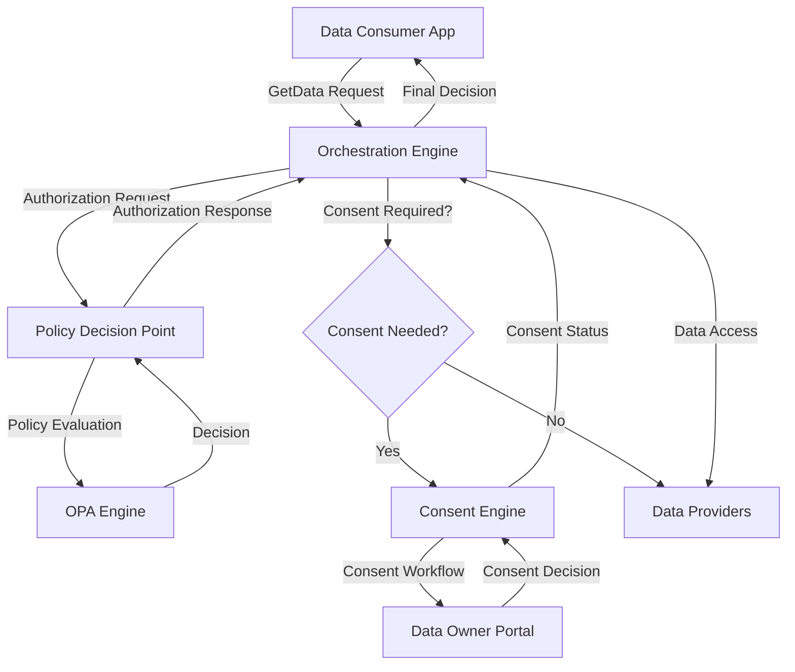

# Data Exchange Platform Flow

## Overview

The Data Exchange Platform implements a comprehensive consent-based data sharing system with policy enforcement and consent management. The platform consists of three main services coordinated by the Orchestration Engine.

## Architecture Flow



## Detailed Flow

### 1. Data Consumer Request

The Data Consumer sends a GetData request to the Orchestration Engine:

```json
{
  "dataConsumer": {
    "id": "passport-app",
    "type": "application"
  },
  "dataOwner": {
    "id": "user-nuwan-fernando-456"
  },
  "request": {
    "type": "GraphQL",
    "query_fields": [
      "fullName",
      "nic",
      "birthDate",
      "permanentAddress"
    ]
  }
}
```

### 2. Policy Decision Point (PDP) Evaluation

The Orchestration Engine forwards the request to the Policy Decision Point (PDP) for authorization:

- **PDP Service**: Embedded OPA engine evaluates Rego policies
- **Data Sources**: 
  - `/policies/main.rego` - Authorization rules
  - `consumer-grants.json` - Consumer permissions
  - `provider-metadata.json` - Field-level metadata and consent requirements

### 3. Authorization Decision Scenarios

#### Access Permitted + Consent Required
```json
{
  "decision": {
    "allow": true,
    "deny_reason": null,
    "consent_required": true,
    "consent_required_fields": [
      "person.permanentAddress",
      "person.birthDate"
    ],
    "data_owner": "user-nuwan-fernando-456",
    "expiry_time": "30d",
    "conditions": {}
  }
}
```

#### Access Denied/Insufficient Permissions
```json
{
  "decision": {
    "allow": false,
    "deny_reason": "Consumer not authorized for requested fields",
    "consent_required": false,
    "consent_required_fields": [],
    "data_owner": "",
    "expiry_time": "",
    "conditions": {}
  }
}
```

#### Access Permitted + No Consent Required
```json
{
  "decision": {
    "allow": true,
    "deny_reason": null,
    "consent_required": false,
    "consent_required_fields": [],
    "data_owner": "",
    "expiry_time": "",
    "conditions": {}
  }
}
```

### 4. Orchestration Engine Response

Based on the PDP decision, the Orchestration Engine:

- **If `allow: false`**: Immediately rejects the request and sends an error back to the Data Consumer
- **If `allow: true` and consent required**: Makes a second API call to the Consent Management Engine (CE)
- **If `allow: true` and no consent needed**: Proceeds to fetch data from Data Providers

## Service Architecture

### Orchestration Engine (OE)
- **Purpose**: Coordinates data access requests between PDP and Consent Engine
- **Technology**: Go + HTTP client coordination
- **Function**: Manages complete consent flow, makes final data access decisions

### Policy Decision Point (PDP) - Port 8082
- **Purpose**: ABAC authorization using Open Policy Agent (OPA)
- **Technology**: Go + Rego policies
- **Function**: Evaluates requests and determines consent requirements

### Consent Engine (CE) - Port 8081
- **Purpose**: Manages data owner consent workflow
- **Technology**: Go + In-memory storage
- **Function**: Creates, manages, and tracks consent records

## Complete Consent Flow

1. **App User** initiates login request to App
2. **App** requests data from Orchestration Engine
3. **Orchestration Engine** forwards request to PDP for authorization
4. **PDP** evaluates request and determines if consent is required for at least 1 field
5. **If consent required**: Orchestration Engine coordinates with Consent Engine
6. **Consent Engine** manages consent workflow and user interaction
7. **Data Owner** provides consent via consent portal
8. **Orchestration Engine** makes final data access decision
9. **Orchestration Engine** returns final decision to App

## API Endpoints

### Policy Decision Point (Port 8082)

| Route | Methods | Purpose |
|-------|---------|---------|
| `/decide` | POST | Authorization decision endpoint |
| `/debug` | GET | Debug information endpoint |

### Consent Engine (Port 8081)

| Route | Methods | Handlers | Purpose |
|-------|---------|----------|---------|
| `/consent` | POST | consentHandler | Create new consent record |
| `/consent/{id}` | GET, PUT, DELETE | consentHandler | Get, update, or revoke consent |
| `/consent/portal` | GET, POST | consentPortalHandler | Portal info and processing |
| `/data-owner/{owner}` | GET | dataOwnerHandler | Get consents by data owner |
| `/consumer/{consumer}` | GET | consumerHandler | Get consents by consumer |
| `/admin/expiry-check` | POST | adminHandler | Check consent expiry |
| `/health` | GET | healthHandler | Health check |

## Configuration

### Consumer Grants
Defines which consumers can access which data fields:

```json
{
  "legacy_consumer_grants": {
    "passport-app": {
      "approved_fields": [
        "person.fullName",
        "person.nic", 
        "person.photo"
      ]
    },
    "driver-app": {
      "approved_fields": [
        "person.fullName",
        "person.birthDate"
      ]
    }
  }
}
```

### Provider Metadata
Defines field-level consent requirements, ownership, and access control:

```json
{
  "fields": {
    "person.fullName": {
      "consent_required": false,
      "owner": "drp",
      "provider": "drp",
      "access_control_type": "public",
      "allow_list": []
    },
    "person.permanentAddress": {
      "consent_required": false,
      "owner": "drp",
      "provider": "drp",
      "access_control_type": "restricted",
      "allow_list": [
        {
          "consumerId": "passport-app",
          "expiry_time": "30d"
        }
      ]
    },
    "person.birthDate": {
      "consent_required": false,
      "owner": "rgd",
      "provider": "drp",
      "access_control_type": "restricted",
      "allow_list": [
        {
          "consumerId": "driver-app",
          "expiry_time": "30d"
        }
      ]
    },
    "person.ssn": {
      "consent_required": true,
      "owner": "rgd",
      "provider": "drp",
      "access_control_type": "restricted",
      "allow_list": [
        {
          "consumerId": "driver-app",
          "expiry_time": "1d"
        }
      ]
    }
  }
}
```

## Field Access Control Logic

### Access Control Types

1. **Public Fields** (`access_control_type: "public"`)
   - Any consumer can access
   - No allow_list restrictions
   - Consent only required if `consent_required: true` AND `provider != owner`

2. **Restricted Fields** (`access_control_type: "restricted"`)
   - Only consumers in `allow_list` can access
   - Consent required if `consent_required: true` AND `provider != owner`

### Consent Requirements

Consent is required when:
- `consent_required: true` AND
- `provider != owner` (data is cross-provider)

## Quick Start

### Prerequisites
- Docker and Docker Compose
- Go 1.24+ (for local development)

### Start Services
```bash
# Start both services
docker-compose up -d

# Check service status
docker ps
```

### Run Tests
```bash
# Run all tests
cd integration-tests
./run-all-tests.sh

# Run individual test suites
./test-pdp.sh                    # PDP policy tests
./test-complete-flow.sh          # End-to-end flow tests
./test-consent-flow.sh           # Basic consent flow tests
./test-complete-consent-flow.sh  # Full consent flow tests
```

## Schema Conversion

The platform supports converting GraphQL SDL schemas to provider metadata format:

### GraphQL SDL Input
```graphql
type User {
  id: ID! @accessControl(type: "public") @source(value: "authoritative") @isOwner(value: true)
  name: String! @accessControl(type: "public") @source(value: "authoritative") @isOwner(value: true)
  email: String! @accessControl(type: "restricted") @source(value: "authoritative") @isOwner(value: false)
}
```

### Converted Provider Metadata
```json
{
  "fields": {
    "user.id": {
      "consent_required": false,
      "owner": "drp",
      "provider": "drp",
      "access_control_type": "public",
      "allow_list": []
    },
    "user.name": {
      "consent_required": false,
      "owner": "drp",
      "provider": "drp",
      "access_control_type": "public",
      "allow_list": []
    },
    "user.email": {
      "consent_required": true,
      "owner": "drp",
      "provider": "drp",
      "access_control_type": "restricted",
      "allow_list": []
    }
  }
}
```

## Security Considerations

- All services run in isolated Docker containers
- Policy evaluation is performed by OPA with immutable policies
- Consent records are tracked and can be revoked
- Field-level access control with consumer-specific allow lists
- Cross-provider data sharing requires explicit consent
